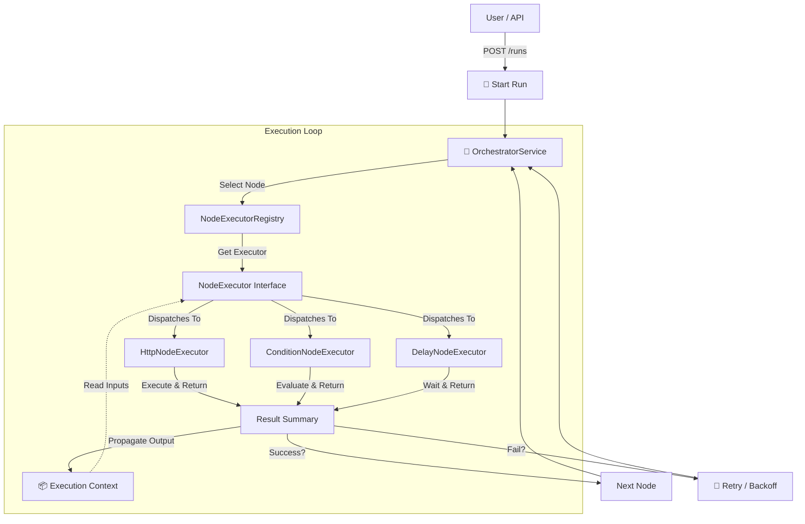

# WorkFlow Builder - Resilient Workflow Engine

Type-safe, graph-based workflow orchestrator built with Spring Boot, Project Reactor, and MongoDB. Designed for high resilience, smart execution, and developer-friendly extensibility.

## 🚀 Key Features

- **Graph-Based Execution**: Define complex flows (Direct Acyclic Graphs) with branching, joining, and loops.
- **Resilient Orchestrator**: Native support for **Exponential Backoff Retries**. If a node fails, the engine retries automatically without crashing the workflow.
- **Stateful Context Propagation**: Outputs from previous nodes are automatically propagated to the shared execution context, accessible by downstream nodes.
- **Intelligent Executors**:
  - **HttpNode**: Automatically detects and parses JSON responses into objects. Uses non-blocking `WebClient`.
  - **ConditionNode**: Supports robust JSONPath expressions, including smart handling of equality checks (e.g., `$.status == 'SUCCESS'`).
- **Global Exception Handling**: Standardized JSON error responses (404, 400, 409, 500) for a robust API contract.


## 🛠️ Architecture

The engine follows the **Strategy Pattern**:



- **`OrchestratorService`**: The core brain. Traverses the node graph, manages state, and handles retries.
- **`NodeExecutorRegistry`**: Selects the appropriate executor at runtime based on node type.
- **`NodeExecutor` Interface**: All node types (`http`, `condition`, `delay`, `trigger`) implement this interface.

## 📋 Technology Stack

- **Java 17+**
- **Spring Boot 3.x**
- **Spring WebFlux (WebClient)**
- **MongoDB** (Persistence for Workflows and Runs)
- **JsonPath** (Expression evaluation)

## 🏃‍♂️ Getting Started

### Prerequisites
- Java 17 SDK
- MongoDB running on `localhost:27017`

### Build & Run
```bash
# Build
mvn clean install

# Run
mvn spring-boot:run
```

## 🔌 API Reference

### 1. Create a Workflow
`POST /api/v1/workflows`

```json
{
    "name": "payment retry flow",
    "description": "Retry payment if failed and notify system",
    "nodes": [
        {
            "id": "n1",
            "type": "http",
            "config": {
                "method": "POST",
                "url": "https://payment-retry.free.beeceptor.com/payment/process",
                "body": {
                    "orderId": "1111",
                    "amount": "1000",
                    "status": "PROCESSING"
                }
            },
            "next": [
                "n2"
            ]
        },
        {
            "id": "n2",
            "type": "condition",
            "config": {
                "expression": "$.n1.status == 'SUCCESS'"
            },
            "onTrue": "n5",
            "onFalse": "n3"
        },
        {
            "id": "n3",
            "type": "delay",
            "config": {
                "seconds": 3
            },
            "next": [
                "n4"
            ]
        },
        {
            "id": "n4",
            "type": "http",
            "config": {
                "method": "POST",
                "url": "https://payment-retry.free.beeceptor.com/payment/retry",
                "body": {
                    "orderId": "1111",
                    "amount": "1000",
                    "status": "RETRY"
                }
            },
            "next": [
                "n5"
            ]
        },
        {
            "id": "n5",
            "type": "http",
            "config": {
                "method": "POST",
                "url": "https://httpbin.org/post",
                "body": {
                    "orderId": "1111",
                    "finalStatus": "COMPLETED"
                }
            }
        }
    ],
    "triggers": [
        {
            "type": "WEBHOOK",
            "webhookId": "payment-test24",
            "secret": "payment1-secret-567"
        }
    ]
}
```

### 2. Trigger a Run
`POST /api/v1/runs`

```json
{
  "workflowId": "<WORKFLOW_ID>"
}
```

### 3. Check Run Status
`GET /api/v1/runs/<RUN_ID>`

Response:
```json
{
  "id": "...",
  "status": "completed",
  "nodes": [
    { "nodeId": "n1", "status": "failed", "summary": { "error": "Timeout" } },
    { "nodeId": "n2", "status": "success", "summary": { "output": { "result": false } } },
    { "nodeId": "n3", "status": "success" },
    { "nodeId": "n4", "status": "success" }
  ]
}
```

## 🛡️ Exception Handling

The API returns consistent JSON errors:

**404 Not Found**
```json
{
  "status": 404,
  "error": "Not Found",
  "message": "Workflow not found with id: 123"
}
```

**400 Bad Request (Validation)**
```json
{
  "status": 400,
  "error": "Validation Failed",
  "message": "{name=Name is required}"
}
```

**409 Conflict**
```json
{
  "status": 409,
  "error": "Data Conflict",
  "message": "Multiple records found when expecting a single result"
}
```
